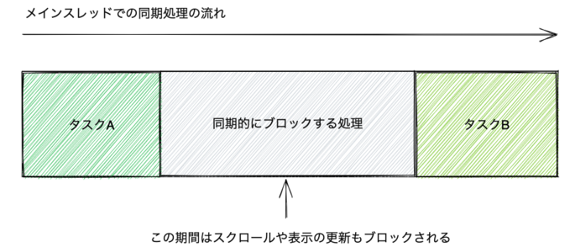
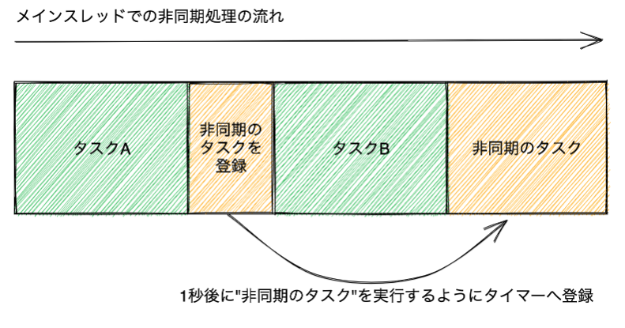

# 非同期処理、モジュール、packagejson

# Asynchronous Prcessing(非同期処理)

## まず基礎知識　First, basic knowledge

- JavaScriptは**イベントループ**という特殊な並行処理の特徴を持つ．
    - イベントループが何かをよく説明してくれている動画
    - [https://www.youtube.com/watch?v=8aGhZQkoFbQ&t=1s](https://www.youtube.com/watch?v=8aGhZQkoFbQ&t=1s)
- JavaScript has a special concurrency feature called **event loop**.
    - Here is a video that explains well what an event loop is
    - [https://www.youtube.com/watch?v=8aGhZQkoFbQ&t=1s](https://www.youtube.com/watch?v=8aGhZQkoFbQ&t=1s)

<aside>
📢 今全部わかる必要はないですが、Call Stackというものがあってそこに関数が積まれてるんだというイメージは持てるようになってください！
It is not necessary to understand everything now, but you should be able to imagine that there is a "Call Stack" and that functions are loaded on it!

</aside>

JavaScriptはシングルスレッド、シングルプロセスの言語→コールスタックも一つ

時間がかかる処理が入ると、スタックがロックされる．

JavaScript is a single-threaded, single-process language -> one call stack

When a time-consuming process enters, the stack is locked.

### 同期処理(sync)

同期処理ではコードを順番に処理していき、ひとつの処理が終わるまで次の処理は行いません。 同期処理では実行している処理はひとつだけとなるため、とても直感的な動作となります。

In synchronous processing, the code is processed in sequence, and the next process is not performed until one process is completed. Synchronous processing is very intuitive because there is only one process being executed.

<aside>
📢 There is a problem of synchronous processing!!

</aside>

- problem of I/O blocking(ブロッキングI/Oの問題)

```tsx
function taskA():void {
    console.log("タスクAを実行 at " + Date.now());
}
function taskB():void {
    console.log("タスクBを実行 at " + Date.now());
}
// 指定した`timeout`ミリ秒経過するまで同期的にブロックする関数
function blockTime(timeout:number):void {
    // Date.now()は現在の時間をUnix時間（1970年1月1日午前0時0分0秒から経過した時間）のミリ秒を返す
    const startTime = Date.now();
    // `timeout`ミリ秒経過するまで無限ループをする
    while (true) {
        const diffTime = Date.now() - startTime;
        if (diffTime >= timeout) {
            return; // 指定時間経過したら関数の実行を終了
        }
    }
}

taskA();
blockTime(1000); // 他の処理を1000ミリ秒（1秒間）ブロックする
taskB();
```

これがブラウザで起こることを考える．

`blockTime`関数の部分が、時間のかかるダウンロード処理だったら、その間ブラウザの動作（スクロールなど）ができなくて、ユーザー体験が非常に悪くなる．

Consider what happens in a browser.

If the `blockTime` part of the function is a time-consuming download process, the user experience will be very poor because the browser will not be able to perform any actions (such as scrolling) during that time.

webブラウザにおいて、JavaScriptはメインスレッド（UIスレッド）で実行されるため、シングルスレッドなので、マルチスレッドでの並行並列処理ができない．また、メインスレッドでブロッキングI/Oが起こると、スクロールや表示の更新もブロックされる．

In a web browser, JavaScript is executed in the main thread (UI thread) and is single-threaded, so it cannot be concurrently executed in multi-threaded mode. If blocking I/O occurs in the main thread, scrolling and display updates are also blocked.



### 非同期処理　asynchronous processing

非同期処理はコードを順番に処理していきますが、ひとつの非同期処理が終わるのを待たずに次の処理を評価します。 つまり、非同期処理では同時に実行している処理が複数あります。

Asynchronous processing processes code in sequence, but does not wait for one asynchronous process to finish before evaluating the next process. In other words, in asynchronous processing, there are multiple processes running simultaneously.

The most famous asynchronous functions is `setTimeout`

```tsx
console.log(1)
setTimeout(() => {
	console.log(2)
}, 1000);
console.log(3)
```

[code sample](https://www.typescriptlang.org/play?#code/MYewdgziA2CmB00QHMAUBGAlAKArALgCoCWAtrCAK76qqYAEAvAHz0De2AkKJDAkmgBMOAL4AaeugAMMzAG5sPKHEQpUAZkxA)



# try catch

## fundamental of try catch

[try...catch - JavaScript | MDN](https://developer.mozilla.org/ja/docs/Web/JavaScript/Reference/Statements/try...catch)

try  chach構文は例外が発生しうるブロックをマークし、例外が発生した時の処理を記述するための構文．

`try`ブロック内で例外が発生すると、`try`ブロック内のそれ以外の処理は実行されず、`catch`節に処理が移動する．

`finaly`は、`try`ブロック内で例外が発生したかどうかに関係なく、必ず`try`文の最後に実行されます．

The try chach syntax marks a block where an exception can occur and describes the process to be executed when an exception occurs.

If an exception occurs in a `try` block, the rest of the processing in the `try` block is not executed, and the processing moves to the `catch` clause.

The `finaly` is always executed at the end of the `try` statement, regardless of whether or not an exception occurs within the `try` block.

example

```bash
try {
    console.log("try節:この行は実行されます");
    // 未定義の関数を呼び出してReferenceError例外が発生する
    undefinedFunction();
    // 例外が発生したため、この行は実行されません
} catch (error) {
    // 例外が発生したあとはこのブロックが実行される
    console.log("catch節:この行は実行されます");
    console.log(error instanceof ReferenceError); // => true
    console.log(error.message); // => "undefinedFunction is not defined"
} finally {
    // このブロックは例外の発生に関係なく必ず実行される
    console.log("finally節:この行は実行されます");
}
```

`catch`と`finally`はどちらかを省略可能

Either `catch` or `finally` can be omitted

```bash
// only catch
try {
    undefinedFunction();
} catch (error) {
    console.error(error);
}

// only finally
try {
    undefinedFunction();
} finally {
    console.log("この行は実行されます");
}
```

## throw

[throw - JavaScript | MDN](https://developer.mozilla.org/ja/docs/Web/JavaScript/Reference/Statements/throw)

`throw`によって、ユーザーは例外を投げられる．

The `throw` allows the user to throw an exception.

```bash
try {
    // 例外を投げる
    throw new Error("例外が投げられました");
} catch (error) {
    // catch節のスコープでerrorにアクセスできる
    console.log(error.message); // => "例外が投げられました"
}
```

## Error

`Error`オブジェクトのインスタンスは`new Error("エラーメッセージ")`で作成します。 

コンストラクタの第一引数には、エラーメッセージとなる文字列を渡します。 

渡したエラーメッセージはErrorの`message`プロパティで参照できます。

An instance of an `Error` object is created with `new Error("error message")`.

The first argument of the constructor is a string that is the error message.

The error message passed can be referenced in the `message` property of Error.

```bash
function assertPositiveNumber(num) {
    if (num < 0) {
        throw new Error(`${num} is not positive.`);
    }
}

try {
    // 0未満の値を渡しているので、関数が例外を投げる
    assertPositiveNumber(-1);
} catch (error) {
    console.log(error instanceof Error); // => true
    console.log(error.message); // => "-1 is not positive."
}
```

<aside>
💡 throwでは、Errorオブジェクトしか投げてはならない！！！
In throw, only Error objects must be thrown!

</aside>

## 非同期処理でのtry catch

アンチパターン　anti-pattern

```tsx
try {
    setTimeout(() => {
        throw new Error("非同期的なエラー");
    }, 10);
} catch (error) {
    // 非同期エラーはキャッチできないため、この行は実行されません
}
console.log("この行は実行されます");
```

以下のように書くしかない

```tsx
// 非同期処理の外
setTimeout(() => {
    // 非同期処理の中
    try {
        throw new Error("エラー");
    } catch (error) {
        console.log("エラーをキャッチできる");
    }
}, 10);
console.log("この行は実行されます");
```

**非同期処理の外**からは**非同期処理の中**で例外が発生したかがわかりません。 非同期処理の外から例外が起きたことを知るためには、非同期処理の中で例外が発生したことを非同期処理の外へ伝える方法が必要です。

From outside of asynchronous processing, it is not known whether an exception occurred within asynchronous processing. In order for people outside of asynchronous processing to know that an exception occurred, there must be a way to tell outside of asynchronous processing that an exception occurred within asynchronous processing.

- callback hell
    
    ```tsx
    setTimeout(() => {
        // 非同期処理の中
        try {
            throw new Error("エラー");
        } catch (error) {
            console.log("エラーをキャッチできる");
        }
        //DBのデータが無事取れた時だけにしたい処理
        console.log("この行は実行されます");//この行は、setTimeoutの中でエラーが起きたかわからない．
        setTimeout(() => {
            try {
                throw new Error("エラー");
            } catch (error) {
                console.log("エラーをキャッチできる");
            }
            setTimeout(() => {
                try {
                    throw new Error("エラー");
                } catch (error) {
                    console.log("エラーをキャッチできる");
                }
            }, 100000)
        }, 5000)
    }, 10);
    ```
    

# Promise

## fundamental

Promiseを扱う非同期処理を行う例は

- 非同期処理をする部分（`asyncPromiseTask`関数）: Promiseのインスタンスを返す
- 非同期処理の結果を扱う部分: Promiseのインスタンスを受け取り、成功時の処理と失敗時の処理をコールバック関数で登録する

An example of asynchronous processing that handles Promise is

- Asynchronous processing part (`asyncPromiseTask` function): returns an instance of Promise
- The part that handles the result of asynchronous processing: Receives the Promise instance and registers the processing on success and failure in callback functions

```tsx
// asyncPromiseTask関数は、Promiseインスタンスを返す
function asyncPromiseTask() {
    return new Promise((resolve, reject) => {
        // さまざまな非同期処理を行う
        // 非同期処理に成功した場合は、resolveを呼ぶ
        // 非同期処理に失敗した場合は、rejectを呼ぶ
    });
}
// asyncPromiseTask関数の非同期処理が成功した時、失敗した時に呼ばれる処理をコールバック関数として登録する
asyncPromiseTask().then(()=> {
    // 非同期処理が成功したときの処理
}).catch(() => {
    // 非同期処理が失敗したときの処理
});
```

- promiseには`then`と`catch`のプロパティが存在する．(ES2015)
- There are `then` and `catch` properties in the PROMISE.(ES2015)

- ES 2018で`finally`が入った
- `finally` in ES2018.

- thenは失敗、成功どちらの場合も受け取る
- catchは失敗の場合のみを受け取る
- then receives both failure and success
- catch accepts only failure.

- `reslove`の値は、`then`メソッドの第一引数に代入する関数に（`then`メソッドの1番目のコールバック関数に）、`reject`渡したエラーオブジェクトは、`then`メソッドの2番目のコールバック関数（`then`メソッドの第二引数に代入される関数に）渡される．
- The value of reslove is passed to the function to be assigned to the first argument of then method (to the first callback function of then method), and the error object passed reject is passed to the second callback function of then method (to the function assigned to the second argument of then method).

実行時に `tsc <file path> --lib ES2015,dom` 

```tsx
function wait(ms: number):Promise<Error | string> {
  return new Promise((resolve, reject) => {
    if (ms < 0) {
      reject(new Error('Invalid time specified'));
    } else {
      setTimeout(() => {
        resolve(`Waited for ${ms}ms`);
      }, ms);
    }
  });
}

//失敗するとき
wait(-100)
  .then(result => {
    console.log(result);
  }, error => {
    console.log(error.message)
  })

//成功するとき
wait(2000)
  .then(result => {
    console.log(result);
  }, error => {
    console.log(error.message)
  })
```

Promiseの`then`メソッドは成功（`onFulfilled`）と失敗（`onRejected`）のコールバック関数の2つを受け取りますが、どちらの引数も省略できます。

The then method of Promise takes two callback functions, one for success (onFulfilled) and one for failure (onRejected), but either argument can be omitted.

```tsx
function delay(timeoutMs) {
    return new Promise((resolve) => {
        setTimeout(() => {
            resolve();
        }, timeoutMs);
    });
}
// `then`メソッドで成功時のコールバック関数だけを登録
delay(10).then(() => {
    console.log("10ミリ秒後に呼ばれる");
});

function delay(timeoutMs) {
    return new Promise((resolve) => {
        setTimeout(() => {
            resolve();
        }, timeoutMs);
    });
}
// `then`メソッドで成功時のコールバック関数だけを登録
delay(10).then(() => {
    console.log("10ミリ秒後に呼ばれる");
});
```

<aside>
📢 つまり、promiseを使うことで、非同期処理の完了を待って、then()の中の処理を実行することができる．
In other words, by using PROMISE, it is possible to wait for the completion of asynchronous processing before executing the processing in then().

</aside>

rejectのみを処理したい場合にはcatchを使う

If you want to process only rejects, use catch.

```tsx
function errorPromise(message) {
    return new Promise((resolve, reject) => {
        reject(new Error(message));
    });
}

errorPromise("catchでエラーハンドリング").catch(error => {
    console.log(error.message); // => "catchでエラーハンドリング"
});
```

## Promise chain

- SyntaxSugar
    
    以下のような記述ができる．
    
    The following statements can be made.
    
    ```tsx
    const fulfilledPromise:Promise<void> = Promise.resolve();
    const rejectedPromise:Promise<Error> = Promise.reject(new Error("エラー"));
    ```
    
    These are the SyntaxSugar.
    
    これらはシンタックスシュガー（糖衣構文）と呼ばれる
    
    同じ意味の処理を元の構文よりシンプルに書ける別の書き方のことです
    
    It is another way of writing the same process that is simpler than the original syntax.
    
    上のコードは意味としては、下と同じ
    
    ```tsx
    const fulfilledPromise = new Promise((resolve) => {
        resolve();
    });
    
    const rejectedPromise = new Promise((resolve, reject) => {
        reject(new Error("エラー"));
    });
    ```
    
    ```tsx
    const promise = Promise.resolve();
    promise.then(() => {
        console.log("2. コールバック関数が実行されました");
    });
    console.log("1. 同期的な処理が実行されました");
    ```
    
    - above is same as
        
        ```tsx
        const promise = new Promise((resolve) => {
            console.log("1. resolveします");
            resolve();
        });
        promise.then(() => {
            console.log("3. コールバック関数が実行されました");
        });
        console.log("2. 同期的な処理が実行されました");
        ```
        
    

VScodeで、 `promise.then()` にカーソルを合わせてみる．`then()`の返り値はPromiseである．つまり以下のようなことができる．

In VScode, hover over `promise.then()`. `then()` returns a `Promise`. In other words, we can do the following.

```tsx
const fulfilledPromise = new Promise((resolve) => {
    resolve();
});

fulfilledPromise.then(()=> {
		console.log(1)
	}).then(()=> {
		console.log(2)
	})
```

 `promise chain`のおかげで以下のようなことができるので嬉しい

以下の関数では、失敗した時には、`catch`の処理のみが、成功した時には、`then`の処理のみが呼ばれる．

```tsx
//this function returns resolve 50%
function asyncTask() {
    return Math.random() > 0.5
        ? Promise.resolve("成功")
        : Promise.reject(new Error("失敗"));
}

asyncTask().then((value) => {　
        console.log(value);
    })
    .catch((error) => {
        console.log(error.message); // => "失敗"
    });
```

<aside>
📢 thenとcatchの順序に注意する
Note the order of then and catch.

</aside>

```tsx
Promise.reject(new Error("エラー")).catch(error => {
    console.error(error); // Error: エラー
}).then(() => {
    console.log("thenのコールバック関数が呼び出される");
});
```

promise chainで値を返す

```tsx
Promise.resolve(1).then((value) => {
    console.log(value); // => 1
    return value * 2;
}).then(value => {
    console.log(value); // => 2
    return value * 2;
}).then(value => {
    console.log(value); // => 4
    // 値を返さない場合は undefined を返すのと同じ
}).then(value => {
    console.log(value); // => undefined
});
```

promise chain 内でのエラーの発生

```tsx
Promise.resolve().then(() => {
    console.log(1)
    throw new Error("error");
}).then(() => {
    console.log(2)
}).catch(error => {
    console.log(error.message);
});
```

さらに複雑なパターン

```tsx
Promise.resolve().then(function onFulfilledA() {
    return Promise.reject(new Error("error"));
}).then(() => {
    console.log(1)
}).catch((error) => {
    console.log(error.message); // => "失敗"
}).then(() => {
    console.log(2)
});
```

frontend で良く出てくるパターン

```tsx
type Res = {
    body: string;
}

function dummyFetch(path: string) {
    return new Promise<Res | Error>((resolve, reject) => {
        setTimeout(() => {
            if (path.startsWith("/resource")) {
                resolve({ body: `Response body of ${path}` });
            } else {
                reject(new Error("NOT FOUND"));
            }
        }, 1000 * Math.random());
    });
}

const results: string[] = [];
dummyFetch("/resource/A").then((response) => {
    if (response instanceof Error) throw new Error('error');
    results.push(response.body);
    return dummyFetch("/resource/B");
}).then(response => {
    if (response instanceof Error) throw new Error('error');
    results.push(response.body);
}).then(() => {
    console.log(results);
});
```

## promise.all

```tsx
function delay(timeoutMs) {
    return new Promise((resolve) => {
        setTimeout(() => {
            resolve(timeoutMs);
        }, timeoutMs);
    });
}
const promise1 = delay(1);
const promise2 = delay(2);
const promise3 = delay(3);

Promise.all([promise1, promise2, promise3]).then(function(values) {
    console.log(values);
});
```

promise.allは引数にとる全てのpromiseが完了するまで待ってから`then()`に移る．

promise.all waits until all the promises it takes as arguments have completed before moving on to `then()`.

- promise race
    
    一つでも完了したら(rejectかresolveになったら)`then()`に移る
    
    タイムアウト処理に使用することが可能
    

### Problem

`tsc <path to file> --lib ES2015,dom` 

<aside>
📢 Please add TYPE ANNOTATION yourself!!!!!!

</aside>

##### 1

Do the same thing below with a Promise object.

Promiseオブジェクトを使って以下と同じことをしてください．

```tsx
function say(callback: () => void, msg:number) {
  setTimeout(callback, msg);
}
say(function():void{
  console.log('ken!!')
}, 1000);
```

<details>
<summary>Answer</summary>

```typescript
//Promiseを返す関数の返り値はジェネリクス型を使う．
//<>の中に関しては、resolveの型を入れておくのが一般的
function say(ms:number):Promise<void>{
 return new Promise((resolve, reject) => {
   //msの分だけまった結果resolveされる．
   setTimeout(resolve, ms);
  });
}

say(1000).then(()=>{
 console.log('ken!');
})
```
</details>

##### 2

Promseオブジェクト作成時にresolveに数値1を渡すコールバックを呼び出し、console出力され、 続くthenメソッドで2を足した値を出力してください。

When creating a Promse object, call a callback passing the number 1 to resolve, which is output to the console, and then output the value added by 2 in the subsequent then method.

- Hint

```tsx
var promise1: (some annotation) = new Promise(function(resolve, reject){
  resolve(1);
})

promise1.then(~~ ~~)
```

<details>
<summary>Answer</summary>

```typescript
var promise1:Promise<number> = new Promise((resolve, reject) => {
  resolve(1);
})
promise1.then((val:number):number => {
  console.log(val);
  return val + 2;
}).then((val: number)=> {
  console.log(val);
});
```
</details>

### 3

最初のPromiseオブジェクトがresolveされたら`私は`という文字列を返し、次のPromiseオブジェクトで文字列`今日、`を返し、次のPromiseオブジェクトで`運がいいです`を返し、 最後のPromiseオブジェクトでそれらが連結された文字列を出力してください。

- Hint

Promiseチェーン

```tsx
const initPromise = new Promise((resolve) =>  {
    resolve('私は')
  })

//lastName, firstNameに当たる関数式を実装しましょう

initPromise.then(lastName).then(firstName).then(comp);
//"私は今日、運がいいです"という出力をしてください．
```


<details>
<summary>Answer</summary>

```typescript
const initPromise:Promise<string> = new Promise((resolve) =>  {
    resolve('私は')
  })

 const sentence1 = (sentence:string):string => {
    return sentence + '今日、'
 }
 const sentence2  = (sentence1:string):string => {
   return sentence1 + '運がいいです'
 }

 const comp = (compName:string):void => {
    console.log(compName)
 }
 
 initPromise.then(sentence1).then(sentence2).then(comp);


initPromise.then(sentence1)
initPromise.then((result) => {
		return result + '今日、'
	}
).then((result)=>{
			
	}
) 


Promise.resolve("I am").then((value:string) => {
console.log("I am")
return value;
}).then(value=>{
console.log("Today")
return value + " Today";
}).then(value => {
console.log("Lucky")
return value + " Lucky";
}).then(value => {
console.log(value);
});
```
</details>

##### 4

Promiseを使って0.5秒後毎に文字列の出力がされる非同期処理を実装をしてください

Implement an asynchronous process that outputs a string every 0.5 seconds using a Promise.

```tsx

f('test1', 500).then(()=>{
  return f('test2', 500)
}).then(()=>{
  f('test3', 500)
})

//出力として、test1, test2, test3が0.5秒ごとに出るような関数fを実装する．
```

<details>
<summary>Answer</summary>

```typescript
function f(name:string, time:number){
  return new Promise((resolve) => {
   setTimeout(() => {
     console.log(name)
   resolve(1);
   }, time)
  });
};

f('test', 500).then(()=>{
  return f('test2', 500)
}).then(()=>{
  f('test3', 500)
})
```
</details>

##### 5

以下の非同期処理が3回呼び出される時、全ての完了を待って'done'を出力する実装をしてください

When the following asynchronous process is called three times, implement the output 'done' after waiting for all the calls to complete

```tsx
function f (name:string, time:number):Promise<number>{
 return new Promise(function(resolve){
   setTimeout(function(){
     console.log(name)
   resolve(1);
   }, time)
  });
};
```

<details>
<summary>Answer</summary>

```typescript
Promise.all([f('morita', 500),f('kkk', 500),f('jji', 500)]).then(()=> console.log("done"))
```
</details>

##### 6

以下の出力結果がどうなるか考えてみましょう．

Consider the following output results.

```tsx
const p1 = Promise.resolve(1)
const p2 = p1.then(x => x * 2)
console.log(p1 === p2)
```

<details>
<summary>Answer</summary>

上の結果はfalseになる．
promiseのthen、catchは呼び出すたびに新しいPromiseが作成されていることを意味する．
</details>

##### 7

以下の出力結果がどうなるか考えてみましょう．

Consider the following output results.

```tsx
Promise.resolve()
  .then(() => { throw new Error("thrown") })
  .then(() => console.log(1))
  .then(() => console.log(2))
  .catch(() => console.log("caught"))
  .then(() => console.log(3))
```

<details>
<summary>Answer</summary>

catchコールバックが成功すれば、catchの戻り値のpromiseはsettledになるので、thenに入れる．
</details>

##### 8

以下の出力結果がどうなるか考えてみましょう．

Consider the following output results.

```tsx
Promise.resolve().then(() => {
  return Promise.resolve(Promise.resolve(Promise.resolve(1)))
}).then(console.log)
```

<details>
<summary>Answer</summary>

promiseは何重にラップしても結果は変わらない．上のコードは以下と同じ意味になる．
```typescript
Promise.resolve().then(() => {
  return Promise.resolve(1)
}).then(console.log)
```
</details>

##### 9

以下の出力結果がどうなるか考えてみましょう．

Consider the following output results.

```tsx
Promise.resolve(1).then(
  () => { throw new Error("oops") },
  () => console.log(2)
).catch(() => console.log(3))
```

<details>
<summary>Answer</summary>

`throw`された結果、`throw` の後ろ側は無視され、catchの処理に進む
</details>

##### 10

以下の出力結果がどうなるか考えてみましょう．

Consider the following output results.

```tsx
Promise.resolve().then(() => console.log(1))
console.log(2)
```

<details>
<summary>Answer</summary>

2が出力されてから、1が出力される．
JavaScriptのイベントループへのタスクの詰まれ方を学ぶと良い．
</details>

##### 11

以下の出力結果がどうなるか考えてみましょう．

Consider the following output results.

```tsx
setTimeout(() => console.log(1), 0)
console.log(2)
```

<details>
<summary>Answer</summary>

0秒待つとしても、非同期関数である、`setTimeout`の方が後で実行される．
</details>

##### 12

以下の出力結果がどうなるか考えてみましょう．

Consider the following output results.

```tsx
const p1 = new Promise((resolve) => {
  console.log(1)
  resolve
})
console.log(2)
```

<details>
<summary>Answer</summary>

1、2の順序で出力される．
</details>


##### 13

以下のコールバック地獄をpromiseを用いて書き換えてください．

```tsx
type Callback<T> = (result: T) => void;

function request1(callback: Callback<number>) {
  setTimeout(() => {
    callback(1);
  }, 1000);
}
 

function request2(result1: number, callback: Callback<number>) {
  setTimeout(() => {
    callback(result1 + 1);
  }, 1000);
}

function request3(result2: number, callback: Callback<number>) {
  setTimeout(() => {
    callback(result2 + 2);
  }, 1000);
}
 

request1((result1) => {
  request2(result1, (result2) => {
    request3(result2, (result3) => {
      console.log(result3);
    });
  });
});
```

<details>
<summary>Answer</summary>

```

```
</details>


# Async Await

## async

ES2017より導入された．`async`がついた関数は自動的に必ずPromiseを返すようになる．

Introduced in ES2017, functions with async will automatically always return a Promise.

以下の関数をVScodeで書き、カーソルをdoAsyncに合わせてみる．

Write the following function in VScode and try to move the cursor to doAsync.

```tsx
async function doAsync() {
    return "値";
}
```

JavaScriptだと以下のようにasync関数は定義できる．

```tsx
async function foo() {}

const bar = async function() {};

const hoge = async() => {};

//const obj = { async method() {} };
```

async funcitonの返り値によって、Promiseがresolveになるか、rejectになるか変わる感じ

```tsx
//単にretourn した時にはresolve
async function resolveFn() {
    return "resolve";
}
resolveFn().then((value) => {
    console.log(value);
});

//throwした時には、reject
async function rejectFn() {
		throw new Error('error') 
}

rejectFn().catch((error) => {
		console.log(error.message)
})

```

## await

async関数の中で使う　use in async function

`await`  wait the `Promise`  instance become `resolve` or `reject` 

`await`式は右辺の`Promise`インスタンスが**Fulfilled**または**Rejected**になるまでその場で非同期処理の完了を待ちます。 そして`Promise`インスタンスの状態が変わると、次の行の処理を再開します。

```tsx
async function asyncFnc() {
	await <Promise instance> //wait untile Promise instatance become resolve or reject
}
```

async関数がPromise instanceを必ず返り値にすることを思い出すと以下のように書ける．

```tsx
async function doAsync() {
    // 非同期処理
}
async function asyncMain() {
    await doAsync();
    console.log("この行は非同期処理が完了後に実行される");
}
```

以下の違いを理解する．

```tsx
async function asyncMain() {
    const value = await Promise.resolve(42);
    console.log('async', value); // => 42
}
asyncMain();

function asyncMain2() {
    const value = Promise.resolve(42);
    console.log('no await', value); // => 42
}
asyncMain2();
```

- コールバックを使うとこれ
    
    ```tsx
    function asyncMain() {
        return Promise.resolve(42).then(value => {
            console.log(value);
        });
    }
    asyncMain();
    ```
    

エラー処理も次のように書ける．

```tsx
async function asyncMain() {
    // await式のエラーはtry...catchできる
    try {
        console.log(1)
        const value = await Promise.reject(new Error("error"));
        console.log(2)
    } catch (error) {
        console.log(error.message);
    }
}
```

### Problem

以下の処理をasync awaitを使って書きなさい

```tsx
function dummyFetch(path) {
    return new Promise((resolve, reject) => {
        setTimeout(() => {
            if (path.startsWith("/resource")) {
                resolve({ body: `Response body of ${path}` });
            } else {
                reject(new Error("NOT FOUND"));
            }
        }, 1000 * Math.random());
    });
}

function fetchAB() {
    const results = [];
    return dummyFetch("/resource/A").then(response => {
        results.push(response.body);
        return dummyFetch("/resource/B");
    }).then(response => {
        results.push(response.body);
        return results;
    });
}
fetchAB().then((results) => {
    console.log(results);
});
```


<details>
<summary>Answer</summary>

```tsx
    function dummyFetch(path):Promise<{body:string}> {
        return new Promise((resolve, reject) => {
            setTimeout(() => {
                if (path.startsWith("/resource")) {
                    resolve({ body: `Response body of ${path}` });
                } else {
                    reject(new Error("NOT FOUND"));
                }
            }, 1000 * Math.random());
        });
    }
    
    async function fetchAB():Promise<string[]> {
        const results :string[]= [];
        const responseA = await dummyFetch("/resource/A");
        results.push(responseA.body);
        const responseB = await dummyFetch("/resource/B");
        results.push(responseB.body);
        return results;
    }
    
    fetchAB().then((results) => {
        console.log(results); // => ["Response body of /resource/A", "Response body of /resource/B"]
    });
```
</details>

### Problem

以下の関数では、2、1の順序で出力されてしまう．なぜだろう．．．．

```tsx
async function asyncFnc(){
	// 時間のかかる処理
　　setTimeout(() => {
		console.log(1)
		}, 1000);
}

async function asyncMain() {
	await asyncFnc()
	console.log(2)
}

asyncMain()
```

<details>
<summary>Answer</summary>

`setTimeout`関数みたいな、元々非同期処理である関数を呼ぶ際には、Promiseの中で読んで、そのPromiseを返すようにしないと待ってもらえない．
    
asyncFncがpromiseのresolveを適切に返せていないから．
    
```tsx
    function asyncFnc(){
        return new Promise(resolve => {
            setTimeout(() => {
              console.log(1)
              resolve(1)
            }, 1000)
        })
    }
    
    async function asyncMain() {
    	await asyncFnc()
    	console.log(2)
    }
    
    asyncMain()
```
</details>
    

## その他

- こういう書き方もできる
    
    ```tsx
    function dummyFetch(path) {
        return new Promise((resolve, reject) => {
            setTimeout(() => {
                if (path.startsWith("/resource")) {
                    resolve({ body: `Response body of ${path}` });
                } else {
                    reject(new Error("NOT FOUND"));
                }
            }, 1000 * Math.random());
        });
    }
    // 複数のリソースをまとめて取得する
    async function fetchAllResources(resources) {
        // それぞれのリソースを取得する非同期処理を呼び出す
        const promises = resources.map((resource) => {
            return dummyFetch(resource);
        });
        // すべてのリソースが取得できるまで待つ
        // Promise.allは [ResponseA, ResponseB] のように結果が配列となる
        const responses = await Promise.all(promises);
        // 取得した結果からレスポンスのボディだけを取り出す
        return responses.map((response) => {
            return response.body;
        });
    }
    const resources = [
        "/resource/A",
        "/resource/B"
    ];
    // リソースを取得して出力する
    fetchAllResources(resources).then((results) => {
        console.log(results); // => ["Response body of /resource/A", "Response body of /resource/B"]
    });
    ```

<details>  
<summary>以下の問題は、初学者は見ないほうが幸せかも．．．</summary> 

イベントループにおいてどのようにタスクがキューに積まれるかとか理解してないといけないので、ここまで学んだ内容を逸脱している．
以下をそれぞれ、実行する前に、どのような順序でるか考えてみましょう．
結果がどうしてそうなるのか説明できるようになりましょう．
    
```tsx
    Promise.resolve()
      .then(() => console.log(1))
      .then(() => console.log(2))
    
    Promise.resolve()
      .then(() => console.log(3))
      .then(() => console.log(4))
```
    
```tsx
    setTimeout(() => console.log(1), 0)
    Promise.resolve().then(() => console.log(2))
```
    
```tsx
    setTimeout(() => {  // callback1
      console.log(1)
      Promise.resolve().then(() => console.log(2))
    }, 0)
    
    setTimeout(() => {  // callback2
      console.log(3)
      Promise.resolve().then(() => console.log(4))
    }, 0)
    
    Promise.resolve()
      .then(() => console.log(5))
      .then(() => console.log(6))
```
</details>  

# 厳密比較再び

```tsx
| y                 | x                 | == | === |
|-------------------|-------------------|----|-----|
| undefined         | undefined         |    |     |
| null              | null              |    |     |             
| true              | true              |    |     |             
| false             | false             |    |     |             
| 'foo'             | 'foo'             |    |     |             
| 0                 | 0                 |    |     |             
| +0                | -0                |    |     |            
| 0                 | false             |    |     |             
| ""                | false             |    |     |             
| ""                | 0                 |    |     |             
| '0'               | 0                 |    |     |             
| '17'              | 17                |    |     |             
| [1, 2]            | '1,2'             |    |     |             
| new String('foo') | 'foo'             |    |     |             
| null              | undefined         |    |     |             
| null              | false             |    |     |             
| undefined         | false             |    |     |             
| {foo: 'bar'}      | {foo: 'bar'}      |    |     |             
| new String('foo') | new String('foo') |    |     |             
| 0                 | null              |    |     |             
| 0                 | NaN               |    |     |             
| 'foo'             | NaN               |    |     |             
| NaN               | NaN               |    |     |             
```

<details>
<summary>answer</summary>

```tsx
    | y                 | x                 | ==    | ===   |
    |-------------------|-------------------|-------|-------|
    | undefined         | undefined         | true  | true  |
    | null              | null              | true  | true  |
    | true              | true              | true  | true  |
    | false             | false             | true  | true  |
    | 'foo'             | 'foo'             | true  | true  |
    | 0                 | 0                 | true  | true  |
    | +0                | -0                | true  | true  |
    | 0                 | false             | true  | false |
    | ""                | false             | true  | false |
    | ""                | 0                 | true  | false |
    | '0'               | 0                 | true  | false |
    | '17'              | 17                | true  | false |
    | [1, 2]            | '1,2'             | true  | false |
    | new String('foo') | 'foo'             | true  | false |
    | null              | undefined         | true  | false |
    | null              | false             | false | false |
    | undefined         | false             | false | false |
    | {foo: 'bar'}      | {foo: 'bar'}      | false | false |
    | new String('foo') | new String('foo') | false | false |
    | 0                 | null              | false | false |
    | 0                 | NaN               | false | false |
    | 'foo'             | NaN               | false | false |
    | NaN               | NaN               | false | false |
```
</details>

# ECMAScriptモジュール

[ECMAScriptモジュール · JavaScript Primer #jsprimer](https://jsprimer.net/basic/module/)

# ECMAScriptバージョン

[ECMAScript · JavaScript Primer #jsprimer](https://jsprimer.net/basic/ecmascript/)

# 参考文献

非同期処理はそれ単体で非常に複雑な概念です．0から1まで全て理解したい場合にはこちらの文献などを参考にしてください．

- [イベントループとプロミスチェーンで学ぶJavaScriptの非同期処理](https://zenn.dev/estra/books/js-async-promise-chain-event-loop)

